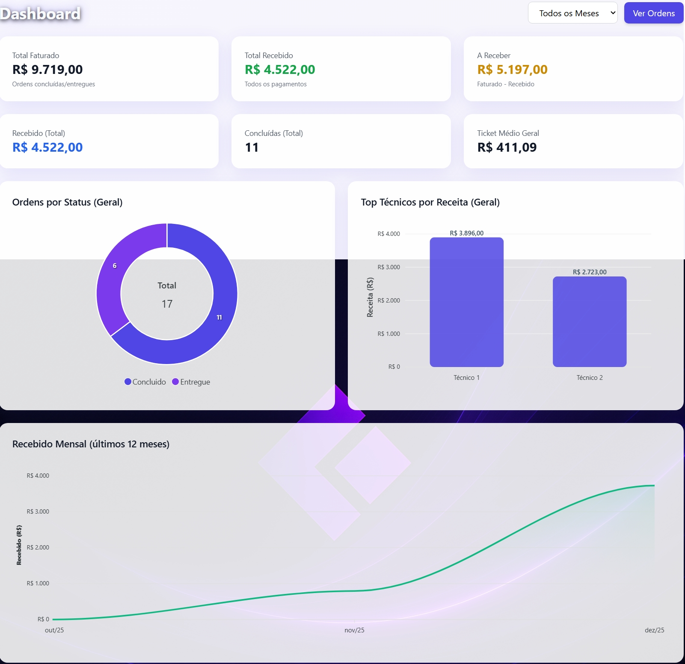
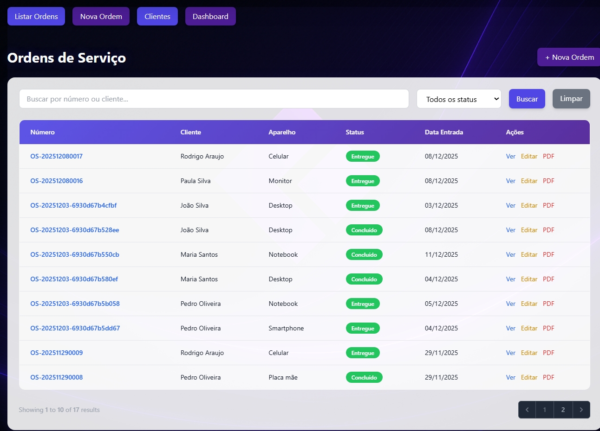
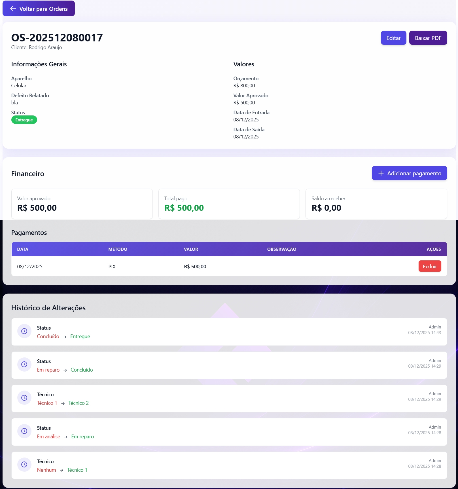
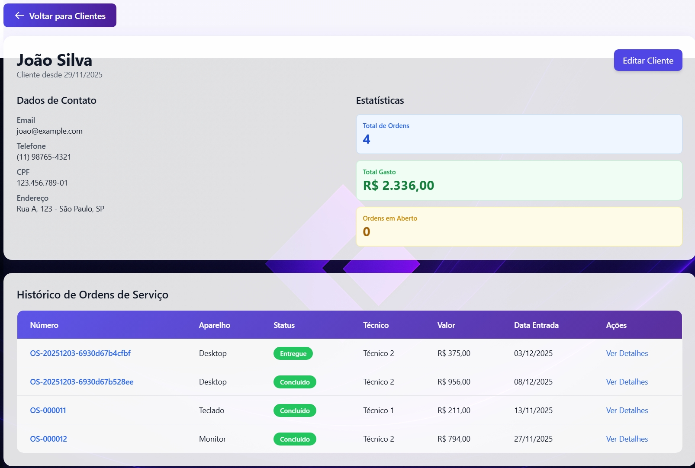

# 🔧 Sistema de Ordens de Serviço para Assistência Técnica

> Sistema completo e moderno para gerenciamento de ordens de serviço técnico com dashboard interativo, controle financeiro, notificações por email e acesso público via token.


## ✨ Funcionalidades Principais

### 📊 Dashboard Interativo
- ✅ **Métricas em Tempo Real** - Total de ordens, receita, tickets abertos e conclusões do mês
- ✅ **Gráficos Dinâmicos** - ApexCharts com visualização de receita mensal, distribuição por status e evolução de conclusões
- ✅ **Filtros Avançados** - Busca por cliente, número da ordem e filtro por status
- ✅ **Design Responsivo** - Interface moderna com Tailwind CSS e gradientes personalizados

### 🛠️ Gestão de Ordens de Serviço
- ✅ **Numeração Automática** - Geração de número único (OS-YYYYMMDD0001)
- ✅ **6 Status Diferentes** - Em análise, Aguardando peça, Em reparo, Concluído, Entregue, Cancelado
- ✅ **Histórico Completo** - Auditoria de todas as alterações (quem, quando, o que mudou)
- ✅ **Atribuição de Técnico** - Designação de responsável por cada ordem
- ✅ **Datas Rastreadas** - Entrada, conclusão e entrega

### 💰 Controle Financeiro
- ✅ **Múltiplos Pagamentos** - Registro de pagamentos parciais ou totais
- ✅ **Cálculo Automático** - Total pago e saldo a receber computados em tempo real
- ✅ **Histórico de Pagamentos** - Data, valor e forma de pagamento registrados

### 👥 Gestão de Clientes
- ✅ **Perfil Detalhado** - Visualização completa com estatísticas do cliente
- ✅ **Estatísticas** - Total de ordens, valor gasto e ordens em aberto
- ✅ **Histórico de Ordens** - Todas as ordens do cliente em ordem cronológica
- ✅ **CRUD Completo** - Criar, editar, visualizar e excluir clientes

### 📧 Notificações por Email
- ✅ **Alertas Automáticos** - Email enviado ao cliente quando o status muda
- ✅ **Acesso Público via Token** - Link único e seguro no email (válido por 30 dias)
- ✅ **Visualização sem Login** - Cliente visualiza sua ordem sem necessidade de cadastro
- ✅ **Sistema de Fila** - Emails processados em background (ShouldQueue)

### 📄 Geração de PDF
- ✅ **PDF Profissional** - Layout customizado com logo e informações completas
- ✅ **Visualizar ou Baixar** - Opções de preview no navegador ou download direto
- ✅ **Informações Completas** - Cliente, aparelho, defeito, valores, status, observações

### 🔐 Segurança e Autenticação
- ✅ **Autenticação Robusta** - Login com email/senha e verificação CSRF
- ✅ **3 Níveis de Acesso** - Admin (acesso total), Técnico (visualização e edição), Guest (acesso público via token)
- ✅ **Rate Limiting** - Limite de 5 tentativas de login por minuto
- ✅ **Security Headers** - X-Frame-Options, CSP, X-XSS-Protection, etc.
- ✅ **Proteção XSS/SQL Injection** - Sanitização de inputs e queries parametrizadas
- ✅ **Logs de Auditoria** - Registro de login, logout e acessos públicos com IP/user-agent
- ✅ **Tokens de Acesso Público** - 64 caracteres hexadecimais com expiração de 30 dias
- ✅ **Regeneração de Sessão** - Prevenção de session fixation attacks

### 🎨 Interface e UX
- ✅ **Design Moderno** - Interface glassmorphism com gradientes e animações
- ✅ **Totalmente Responsiva** - Adaptada para desktop, tablet e mobile
- ✅ **Modais Customizados** - Confirmações visuais com Alpine.js
- ✅ **Feedback Visual** - Toasts, badges coloridos por status, loading states
- ✅ **Timeline Visual** - Linha do tempo do progresso da ordem

## �️ Tecnologias Utilizadas

### Backend
- **Laravel 11** - Framework PHP moderno e robusto
- **PHP 8.2+** - Linguagem de programação
- **SQLite/PostgreSQL** - Banco de dados relacional
- **Eloquent ORM** - Mapeamento objeto-relacional

### Frontend
- **Blade Templates** - Engine de templates do Laravel
- **Livewire 3** - Componentes reativos full-stack
- **Tailwind CSS 3** - Framework CSS utility-first
- **Alpine.js** - Framework JavaScript minimalista
- **ApexCharts** - Biblioteca de gráficos interativos

### Bibliotecas e Ferramentas
- **Barryvdh DomPDF** - Geração de PDFs
- **Laravel Notifications** - Sistema de notificações
- **Laravel Queues** - Processamento assíncrono
- **Middleware Customizado** - Security Headers, Admin, TrustProxies

## 🛠️ Instalação e Configuração

### Pré-requisitos

- PHP 8.2+
- Composer
- PostgreSQL 12+
- Node.js (para Tailwind CSS)

### Passos

1. **Clone o repositório**
   ```bash
   cd "Sistema de Ordens de Serviço para Assistência Técnica"
   ```

2. **Instale as dependências PHP**
   ```bash
   composer install
   ```

3. **Configure o arquivo .env**
   ```bash
   cp .env.example .env
   php artisan key:generate
   ```
   
   Edite o `.env` e configure as credenciais do PostgreSQL:
   ```
   DB_CONNECTION=pgsql
   DB_HOST=127.0.0.1
   DB_PORT=5432
   DB_DATABASE=ordem_servico
   DB_USERNAME=postgres
   DB_PASSWORD=sua_senha
   ```

4. **Crie o banco de dados PostgreSQL**
   ```bash
   createdb ordem_servico -U postgres
   ```

5. **Execute as migrations**
   ```bash
   php artisan migrate
   ```

6. **Execute os seeders (dados de teste)**
   ```bash
   php artisan db:seed
   ```

7. **Inicie o servidor**
   ```bash
   php artisan serve
   ```

8. **Acesse a aplicação**
   ```
   http://localhost:8000
   ```

## 👤 Dados de Teste

Após executar os seeders, use as seguintes credenciais:

| Tipo | Email | Senha | Permissões |
|------|-------|-------|------------|
| **Admin** | admin@example.com | password | Acesso total (criar, editar, excluir ordens/clientes/pagamentos) |
| **Técnico** | tecnico1@example.com | password | Visualizar e editar ordens, sem permissão de exclusão |
| **Técnico** | tecnico2@example.com | password | Visualizar e editar ordens, sem permissão de exclusão |

## 📁 Estrutura do Projeto

```
├── app/
│   ├── Http/
│   │   ├── Controllers/
│   │   └── Livewire/
│   └── Models/
├── database/
│   ├── migrations/
│   └── seeders/
├── resources/
│   └── views/
│       ├── layouts/
│       ├── livewire/
│       ├── ordensservico/
│       ├── pdf/
│       └── auth/
├── routes/
└── config/
```

## 🔐 Segurança Implementada (OWASP Top 10)

### Proteções Ativas
- ✅ **CSRF Protection** - Token em todos os formulários
- ✅ **XSS Prevention** - Sanitização automática do Blade (`{{ }}`)
- ✅ **SQL Injection** - Queries parametrizadas via Eloquent ORM
- ✅ **Clickjacking** - Header `X-Frame-Options: SAMEORIGIN`
- ✅ **MIME Sniffing** - Header `X-Content-Type-Options: nosniff`
- ✅ **Content Security Policy** - CSP configurado para Tailwind/Alpine CDNs
- ✅ **Rate Limiting** - 5 tentativas de login por minuto
- ✅ **Session Security** - Regeneração de ID em login/logout
- ✅ **Password Hashing** - Bcrypt com salt automático
- ✅ **Audit Logging** - Logs de acesso com IP e user-agent
- ✅ **Public Token System** - Tokens hexadecimais de 64 chars com expiração

### Documentação Completa
Consulte [SEGURANCA.md](SEGURANCA.md) para detalhes sobre todas as medidas de segurança implementadas.

## 📝 Campos da Ordem de Serviço

- **Número da Ordem**: Gerado automaticamente (OS-YYYYMMDD0001)
- **Cliente**: Selecionado do banco de clientes
- **Aparelho**: Tipo de equipamento (Notebook, Desktop, Impressora, etc.)
- **Defeito Relatado**: Descrição detalhada do problema
- **Status**: Em análise, Aguardando peça, Em reparo, Concluído, Entregue, Cancelado
- **Orçamento**: Valor inicial estimado
- **Valor Aprovado**: Valor aprovado pelo cliente
- **Data de Entrada**: Data em que a ordem foi criada
- **Data de Conclusão**: Data em que o serviço foi concluído
- **Técnico Responsável**: Técnico atribuído ao serviço
- **Observações**: Notas adicionais sobre o serviço

## 📊 Funcionalidades do Livewire

### ListarOrdensServico
- Listagem paginada de ordens
- Busca por número da ordem ou nome do cliente
- Filtro por status
- Links para visualizar, editar e gerar PDF

### CriarOrdemServico
- Formulário reativo para criar novas ordens
- Validação em tempo real
- Geração automática de número de ordem

### EditarOrdemServico
- Formulário para editar ordens existentes
- Seleção de técnico responsável
- Atualização de status

## 📄 Geração de PDF

O sistema gera PDFs profissionais das ordens de serviço com:
- Informações do cliente
- Detalhes do equipamento
- Defeito relatado
- Orçamento e valor aprovado
- Status atual
- Observações
- Data e hora de geração

## 🔧 Troubleshooting

### Erro de conexão com PostgreSQL
Verifique se:
- PostgreSQL está rodando
- As credenciais no `.env` estão corretas
- O banco de dados foi criado
- O usuário tem permissão para acessar o banco

### Erro ao gerar PDF
- Verifique se a biblioteca WKHTMLTOPDF está instalada
- Ou use a biblioteca padrão DomPDF que já vem configurada

### Port 8000 já está em uso
```bash
php artisan serve --port=8080
```

## � Screenshots

### 🔐 Tela de Login


### 📊 Dashboard Principal


### 🛠️ Gestão de Ordens de Serviço


### 📋 Histórico de Alterações


### 👤 Perfil do Cliente


### 📄 Exemplo de PDF Gerado


## 🚀 Deploy

### Opções de Hospedagem Gratuita
- **Railway** (recomendado) - $5 crédito mensal grátis
- **Render.com** - 750 horas grátis por mês
- **Fly.io** - Plano hobby gratuito
- **Ngrok** - Túnel local para demo temporário

### Configurações de Produção
Consulte [DEPLOY_RAILWAY.md](DEPLOY_RAILWAY.md) para instruções detalhadas de deploy.

## 📚 Documentação Adicional

- **[SEGURANCA.md](SEGURANCA.md)** - Guia completo de segurança implementada
- **[NOTIFICACOES_EMAIL.md](NOTIFICACOES_EMAIL.md)** - Configuração de emails (Mailtrap/Gmail)
- **[DEPLOY_RAILWAY.md](DEPLOY_RAILWAY.md)** - Passo a passo para deploy no Railway
- [Laravel Docs](https://laravel.com/docs)
- [Livewire Docs](https://livewire.laravel.com)
- [Tailwind CSS Docs](https://tailwindcss.com)

## 🎯 Conceitos Aplicados

### Arquitetura e Padrões
- **MVC** - Model-View-Controller
- **Repository Pattern** - Separação de lógica de dados
- **Service Layer** - Camada de serviços para lógica de negócio
- **Observer Pattern** - Eventos e Listeners do Laravel
- **SOLID Principles** - Clean Code e Single Responsibility

### Técnicas de Desenvolvimento
- **Full-Stack Reactivity** - Livewire para SPA-like experience
- **Server-Side Rendering** - Blade templates performáticos
- **Database Migrations** - Versionamento de banco de dados
- **Seeders e Factories** - Dados de teste automatizados
- **Middleware Pipeline** - Filtros HTTP customizados
- **Queue System** - Processamento assíncrono de emails

## 🤝 Contribuindo

Contribuições são bem-vindas! Sinta-se à vontade para:
- Reportar bugs
- Sugerir novas funcionalidades
- Melhorar a documentação
- Submeter Pull Requests

## 📝 Licença

Este projeto está sob a licença MIT. Veja o arquivo [LICENSE](LICENSE) para mais detalhes.

## 👨‍💻 Autor

**Sistema de Ordens de Serviço**  
Desenvolvido como projeto de portfólio demonstrando habilidades em:
- Desenvolvimento Full-Stack com Laravel
- Design de interfaces modernas e responsivas
- Implementação de melhores práticas de segurança
- Arquitetura de software escalável

---

⭐ **Se este projeto foi útil, considere deixar uma estrela!**

**Desenvolvido com ❤️ usando Laravel 11 + Livewire 3 + Tailwind CSS**
